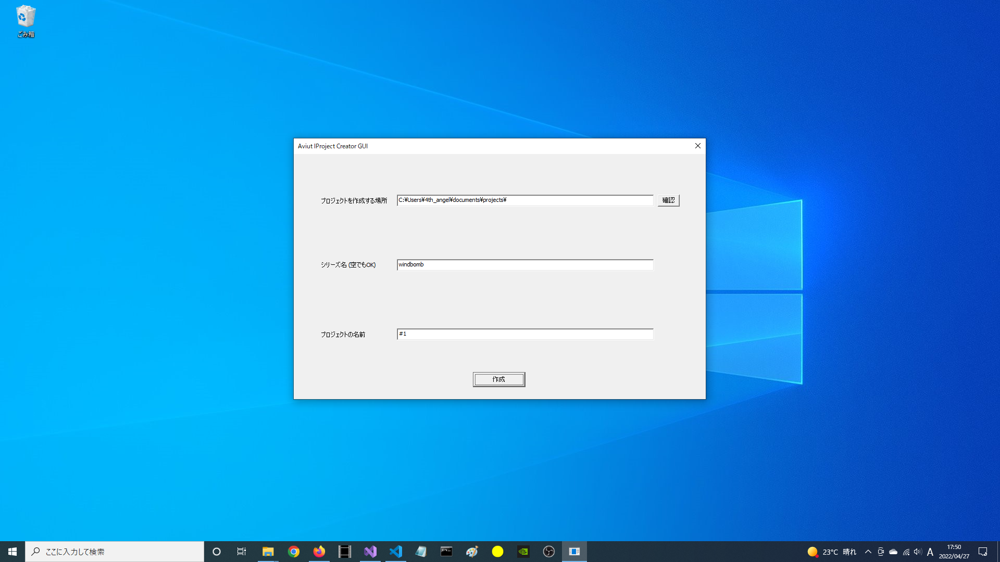

# AviutlProjectCreatorGUI
「AviutlProjectCreatorGUI」は Aviutlで使う(?)フォルダを作るためのプログラムです。

## ビルド環境
ビルドには「Visual Studio 2022」が必要です。  
  
言語バージョンは 「ISO C++ 20 標準 (/std:c++20)」です。  

### 注意
[プログラミング初心者](https://qiita.com/yumetodo/items/a843bd542106215bbc84)が作ったため、スパゲッティかもしれません。  
許してください。  

## 使い方
そのまま立ち上げて  
- プロジェクトを作る場所 (パス)  
- シリーズ名 (なくてもOK)  
- プロジェクト名  
を入力するだけです。  

  

あとは勝手にフォルダを作成してくれます。

### フォルダ構成
フォルダ構造は、シリーズ名が入力されていると、
```
%PROJPATH%/
 ├ %SERIESNAME%/
   └ %PROJNAME%/
     └ contents.md
```
のようになります。  
また、シリーズ名が空の場合は、直接、プロジェクトを作る場所に、プロジェクト名のフォルダができます。
```
%PROJPATH%/
 ├ %SERIESNAME%/
   └ %PROJNAME%/
     └ contents.md
```

### その他の機能
AviutlProjectCreatorGUI には、Markdownを自動生成する機能と、
追加でフォルダを生成する機能があります。  
  
まず、追加でフォルダを生成する機能についてですが、こちらは、「config」というフォルダの中にある「adddir.txt」という、テキストファイルに、
作りたいフォルダを、改行区切りで書いてください。  
  
次に、Markdownですが、「config」というフォルダの中にある「template.md」という Markdownが最初から用意されています。  
なので、そのファイルを編集してみてください。  
  
そして、この2つのファイルには、プロジェクト名などを自動で置換する機能があります。  

置換前文字列 | 置換後文字列
--- | ---
%DATE%    | プロジェクトを作ったときの日付 (Y年M月D日形式)
%DATEISO% | プロジェクトを作ったときの日付 (ISO形式)
%YEAR% | プロジェクトを作ったときの年
%MONTH% | プロジェクトを作ったときの月
%DAY% | プロジェクトを作ったときの日
%HOUR% | プロジェクトを作ったときの時
%MINUTE% | プロジェクトを作ったときの分
%SECOND% | プロジェクトを作ったときの秒
%TIME_T% | プロジェクトを作ったときの std::time() の戻り値
%PROJPATH% | プロジェクトのあるパス
%PROJNAME% | プロジェクトの名前
%SERIESNAME% | シリーズの名前 (入力しなかったときは空)

この機能を利用して、シリーズや、プロジェクトごとに、フォルダを作ることができます。  

## ライセンス
AviutlProjectCreatorGUIは、[MIT LICENSE](https://github.com/soramakura/AviutlProjectCreator/blob/master/LICENSE)
で提供されます。

---
# AviUtlProjectCreator
「AviutlProjectCreatorGUI」の CUI版。こっちのほうが先に作った ~~(その後、AviutlProjectCreatorGUIで書いたコードを基にコードを書き直した)~~。  

## 使い方
AviutlProjectCreatorGUIとほぼ同じ。  
なお、こちらのバイナリは提供していませんので、自分でビルドしてください。

## ライセンス
AviutlProjectCreatorは、[MIT LICENSE](https://github.com/soramakura/AviutlProjectCreator/blob/master/LICENSE)
で提供されます。
